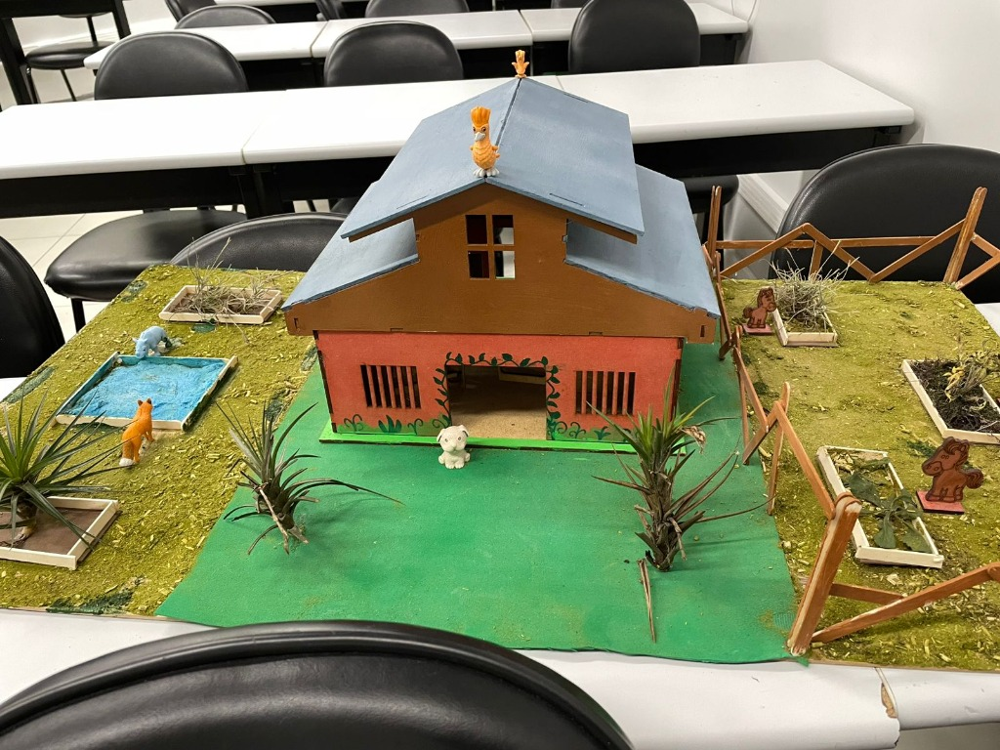
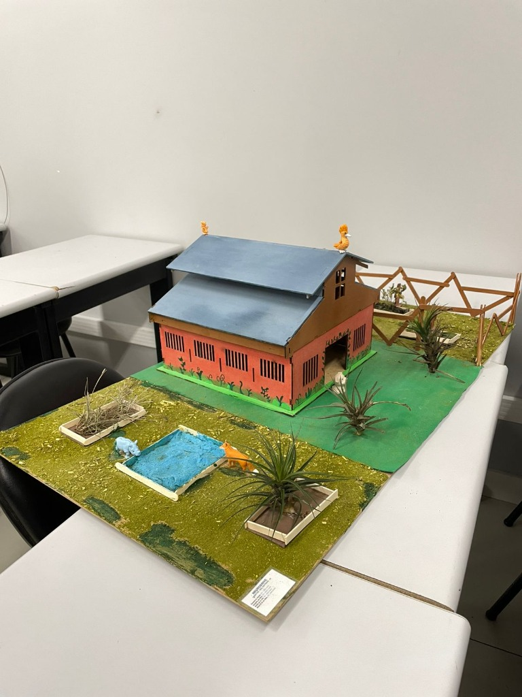
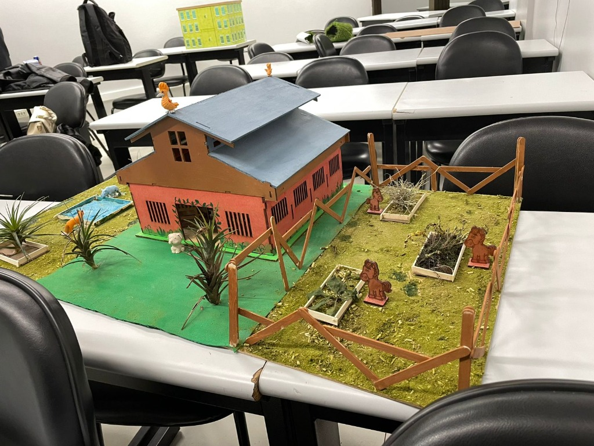
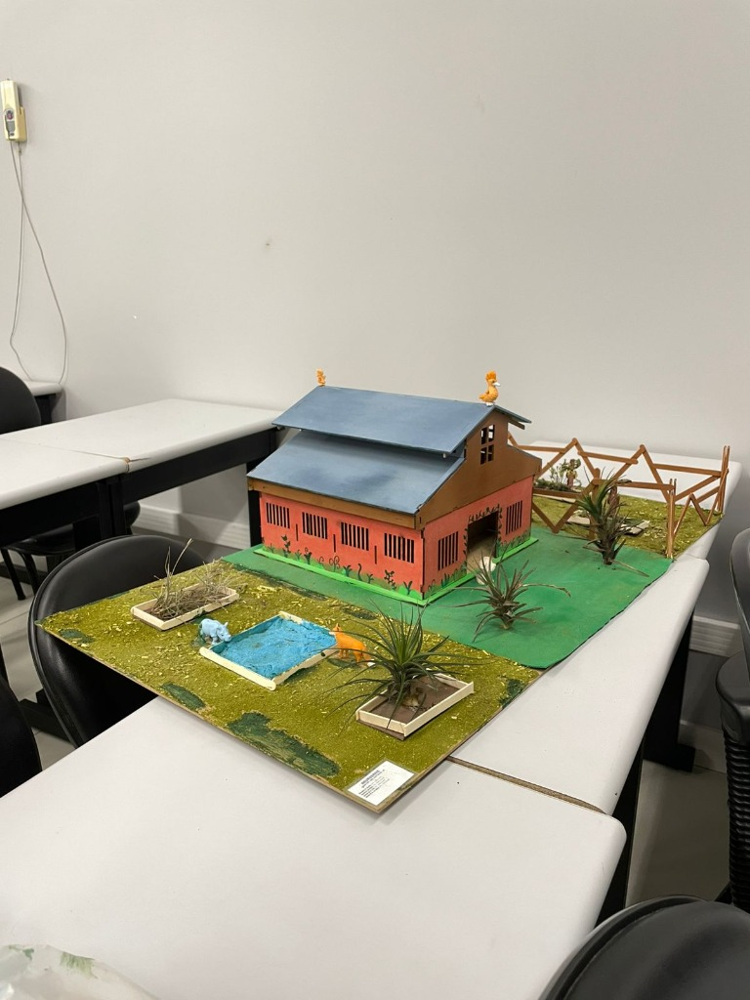
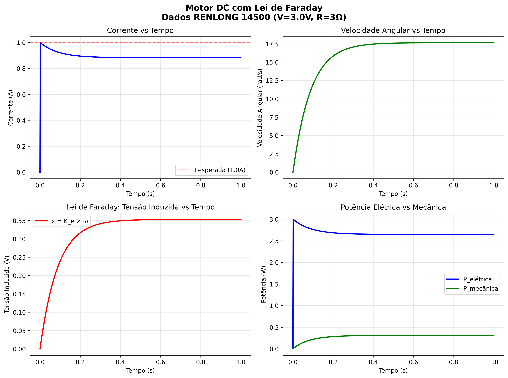
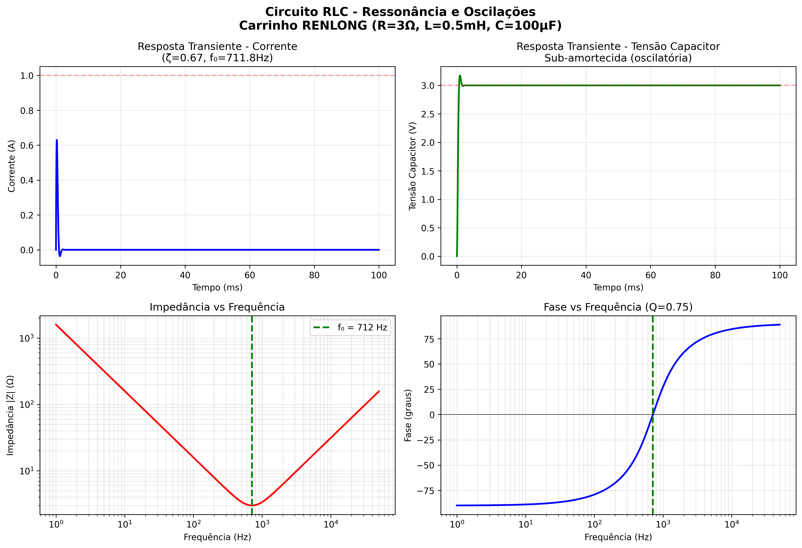
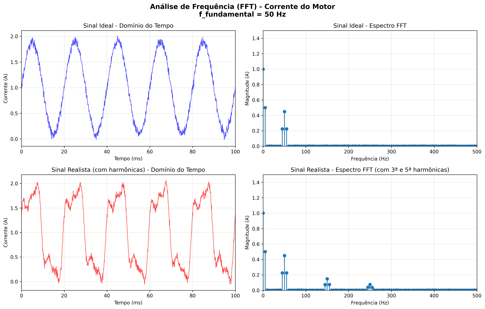
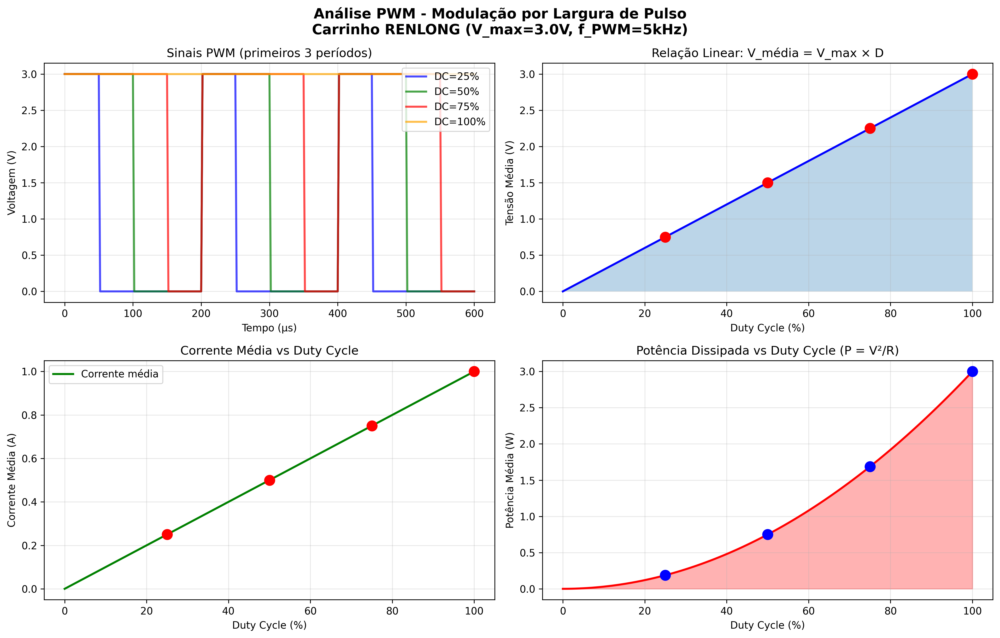
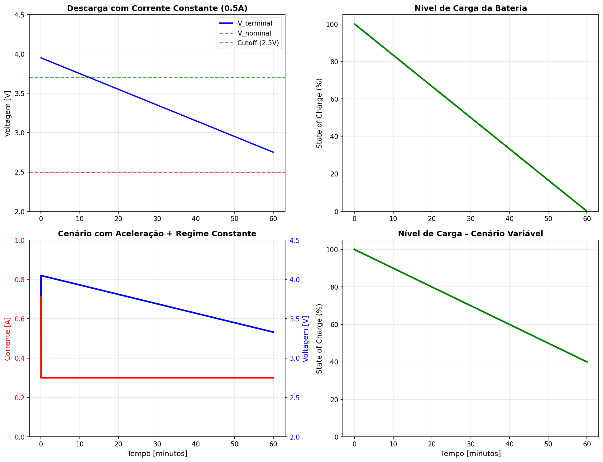

<div align="center">

# ⬡ NeuroDrive
### Plataforma Experimental de IoT e Visão Computacional

*Solução Digital (A3) — Fenômenos Elétricos, Magnéticos e Oscilatórios*  
*UniRitter 2026/1 · 🥉 3º Lugar — A Jornada UniRitter 2026 · Certificado de Honra ao Mérito*


</div>

---

## O que é

NeuroDrive é um sistema embarcado de telemetria que integra **visão computacional**, **sensores de smartphone** e **simulações eletromagnéticas** aplicadas a uma maquete física na escala **1:24**.

A câmera do celular transmite vídeo via Wi-Fi para um servidor Flask, que processa cada frame em tempo real usando o algoritmo de **Lucas-Kanade (Optical Flow)** para extrair odometria visual — velocidade instantânea, aceleração e histórico de corrida. Os dados são transmitidos ao dashboard via **SSE (Server-Sent Events)** e exibidos num velocímetro HUD renderizado com OpenCV.

Em paralelo, scripts SciPy simulam os fenômenos eletromagnéticos reais do motor e circuito: Força Contra-Eletromotriz, ressonância RLC e análise de harmônicas por FFT.

---

## Fotos da Maquete

<div align="center">

| Vista Frontal | Perspectiva Lateral |
|:---:|:---:|
|  |  |
| Vista Direita | Vista Esquerda |
|  |  |

</div>

---

## Arquitetura do Sistema

```
┌─────────────────────────────────────────────────────────────┐
│  SMARTPHONE                                                 │
│  ┌──────────────┐   ┌─────────────────┐                    │
│  │ IP Webcam    │   │  Sensor Logger  │                    │
│  │ /video (MJPEG)│  │  Acelerômetro   │                    │
│  │ /shot.jpg    │   │  GPS Speed      │                    │
│  └──────┬───────┘   └────────┬────────┘                    │
└─────────┼────────────────────┼────────────────────────────-┘
          │ HTTP Wi-Fi         │ HTTP POST /data
          ▼                    ▼
┌─────────────────────────────────────────────────────────────┐
│  WEB_SERVER.PY (Flask)                                      │
│                                                             │
│  AsyncIPCamera ──► neurodrive_pipeline.py                   │
│  (Zero-Delay)       │                                       │
│                     │  OdometriaVisual                      │
│                     │  ├─ Lucas-Kanade Optical Flow         │
│                     │  ├─ Calibração px→mm persistida       │
│                     │  ├─ Modo: real / sensor / listras     │
│                     │  └─ HUD velocímetro (OpenCV)          │
│                     │                                       │
│  /video ────────────┤  MJPEG stream                        │
│  /api/telemetria ───┘  SSE 10Hz (JSON)                      │
│  /api/config_camera    POST                                 │
└─────────────────────────────────────────────────────────────┘
          │
          ▼
┌─────────────────────────┐
│  web/index.html          │
│  Dashboard PWA           │
│  Velocímetro · G-meter   │
│  Histórico · Telemetria  │
└─────────────────────────┘
```

---

## Módulos de Simulação (Física Aplicada)

Os scripts a seguir resolvem numericamente os fenômenos eletromagnéticos do motor DC do carrinho (RENLONG 14500, 3.7V/500mAh, R=3Ω).

### `motor_simulation_v2_faraday.py` — Lei de Faraday e BEMF

Modelo eletromagnético completo via `scipy.integrate.odeint`:

```
V_entrada = I×R + L×(dI/dt) + ε_induzida
ε_induzida = K_e × ω          (Força Contra-Eletromotriz — Lei de Faraday)
τ = K_t × I                   (Torque)
J×(dω/dt) = τ - b×ω           (Dinâmica rotacional)
```

Com motor travado (ω=0): I_max = V/R = 3.0/3.0 = **1.0 A**  
Em regime estacionário (ω>0): corrente cai conforme BEMF cresce.



---

### `circuito_rlc.py` — Ressonância e Amortecimento

Circuito RLC série com parâmetros medidos do carrinho:

| Parâmetro | Valor |
|---|---|
| R (motor) | 3 Ω |
| L (indutância bobina) | 0,5 mH |
| C (capacitor filtro) | 100 µF |
| **f₀ = 1/(2π√LC)** | **~225 Hz** |
| ζ = R/(2√(L/C)) | Sub-amortecido (oscilatório) |



---

### `analise_frequencia.py` — FFT e Harmônicas

Análise espectral da corrente do motor usando Transformada Rápida de Fourier:

```
X[k] = Σ(n=0 a N-1) x[n] × e^(-j2πkn/N)
```

- Janela de Hanning para redução de vazamento espectral  
- Cálculo de THD (Total Harmonic Distortion)  
- Detecção de 3ª e 5ª harmônicas (ruído de chaveamento PWM)



---

### `pwm_analise.py` — Controle PWM

Modelagem do controle de potência via Modulação por Largura de Pulso aplicada ao motor DC (Eletrodinâmica).



---

### `analise_bateria.py` — Curva de Descarga

Simulação da autonomia e curva de descarga da bateria LiPo 3.7V/500mAh.



---

## Pipeline de Visão Computacional

**`neurodrive_pipeline.py` — Classe `OdometriaVisual`**

```python
# 1. Downscale 50% para reduzir carga matricial
frame_small = cv2.resize(frame, (w//2, h//2))

# 2. Região de interesse trapezoidal (perspectiva de pista)
mascara = np.zeros_like(frame_small)
cv2.fillPoly(mascara, pts_trapezio, 255)

# 3. Lucas-Kanade Optical Flow
pontos_novos, status, _ = cv2.calcOpticalFlowPyrLK(
    frame_anterior, frame_atual, pontos_rastreados, None,
    winSize=(15,15), maxLevel=2
)

# 4. Mediana dos deslocamentos → velocidade física
desl_mm = mediana_px * fator_px_mm          # calibração px→mm
velocidade = (desl_mm / 1000.0 / delta_t) * 3.6 * escala  # km/h
```

**Modos de operação:**

| Modo | Fonte de dados |
|---|---|
| `real` | Optical Flow calibrado (px→mm) |
| `sensor` | Acelerômetro + GPS do smartphone |
| `listras` | Detecção de faixas no piso (HSV) |
| `demo` | Simulação automática |
| `simulado` | Flow proporcional sem calibração |

**Atalhos em tempo real:**

| Tecla | Ação |
|---|---|
| `C` | Iniciar/finalizar calibração px→mm |
| `S` | Alternar modo de odometria |
| `L` | Alternar layout HUD (velocímetro / cyber) |
| `I` | Ligar/desligar IA (Optical Flow) |
| `R` | Resetar estatísticas |
| `Q` | Encerrar |

---

## Instalação e Uso

**Pré-requisitos:** Python 3.10+, smartphone com [IP Webcam](https://play.google.com/store/apps/details?id=com.pas.webcam) ou [Sensor Logger](https://apps.apple.com/app/sensor-logger/id1531582925)

```bash
# 1. Clone o repositório
git clone https://github.com/eduardo-a-xavier/neurodrive-.git
cd neurodrive-

# 2. Instale as dependências
pip install -r requirements.txt

# 3. Configure o IP da câmera (opcional — pode configurar pelo dashboard)
echo "CAMERA_IP=192.168.x.x:8080" > .env

# 4. Inicie o servidor
python web_server.py
```

Acesse `http://localhost:5000` (ou o IP local exibido no terminal).

**Para rodar as simulações individualmente:**
```bash
python motor_simulation_v2_faraday.py   # Gera faraday_motor_response.png
python circuito_rlc.py                  # Gera rlc_resonancia.png
python analise_frequencia.py            # Gera fft_analise_frequencia.png
python pwm_analise.py                   # Gera pwm_analise.png
python analise_bateria.py               # Gera analise_bateria.png
```

---

## Ementa Aplicada

| Conteúdo | Aplicação no Projeto |
|---|---|
| Cálculo Diferencial / EDOs | `odeint` para BEMF e circuito RLC |
| Álgebra Linear / Matrizes | Optical Flow — transformações frame a frame |
| Eletromagnetismo / Faraday | Modelo BEMF do motor DC, correntes induzidas |
| Fenômenos Oscilatórios | Circuito RLC, frequência natural f₀ = 225 Hz |
| Números Complexos / Fourier | FFT com janela Hanning, cálculo de THD |
| PWM / Eletrodinâmica | Controle de potência do motor por PWM |

---

<div align="center">

**UniRitter · Engenharia de Software · 2026/1**  
*Projeto desenvolvido para Avaliação A3 — Fenômenos Elétricos, Magnéticos e Oscilatórios*

</div>
